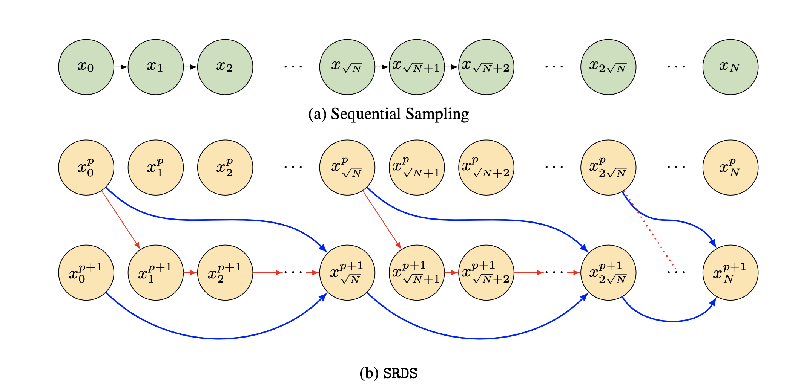

# Self-Refining Diffusion Samplers (SRDS): Parallel Diffusion Sampling via Parareal Iterations

This repository is for the NeurIPS 2024 paper:

Self-Refining Diffusion Samplers: Enabling Parallelization via Parareal Iterations

by *Nikil Roashan Selvam, Amil Merchant,* and *Stefano Ermon*.

> :warning: Code coming soon!

# Summary

-  In diffusion models, samples are generated through an iterative refinement process, requiring hundreds of sequential model evaluations.

-  Several recent methods have introduced approximations (fewer discretization steps or distillation) to trade off speed at the cost of sample quality. In contrast, we introduce Self-Refining Diffusion Samplers (`SRDS`) that retain sample quality and can improve latency at the cost of additional parallel compute.

- We take inspiration from the Parareal algorithm, a popular numerical method for parallel-in-time integration of differential equations.
  -  In `SRDS`, a quick but rough estimate of a sample is first created and then iteratively refined *in parallel* through Parareal iterations.
  - `SRDS` is not only guaranteed to accurately solve the ODE and converge to the serial solution but also benefits from parallelization across the diffusion trajectory, enabling batched inference and pipelining.

  

- As we demonstrate for pre-trained diffusion models, the early convergence of this refinement procedure drastically reduces the number of steps required to produce a sample, speeding up generation for example by up to 1.7x on a 25-step StableDiffusion-v2 benchmark and up to 4.3x on longer trajectories.

*A visualization of the iterative refinement provided by the `SRDS` algorithm on a sample from StableDiffusion with the prompt `a beautiful castle, matte painting.' The initial coarse solve (left) via limited steps provides a rough estimate of the sample, which iteratively refined through iterations of our algorithm. Early convergence is observed as the 3rd output nearly matches, a key feature that enables efficient generation.*

